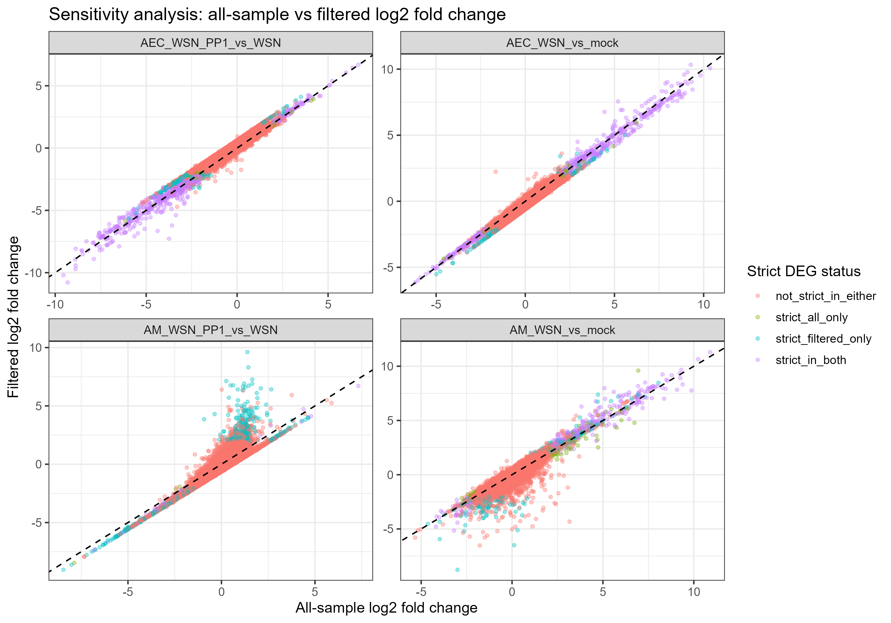
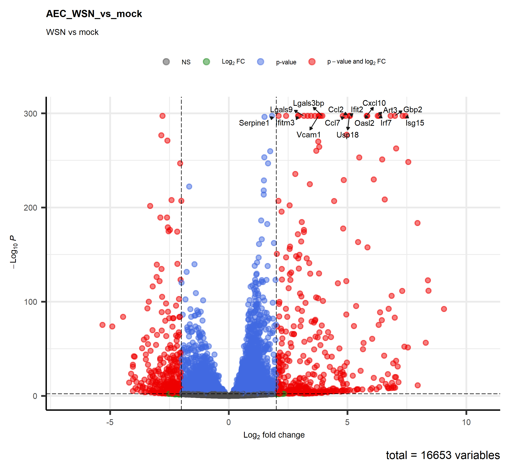
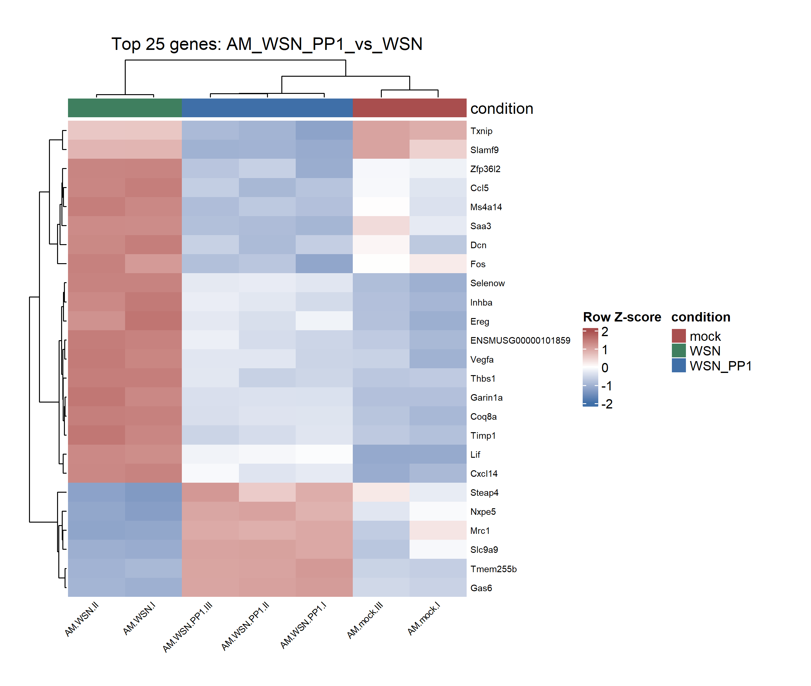

# 🧬 RNA-seq DESeq2 Differential Expression and Reporting Workflow

Reproducible RNA-seq QC, differential expression analysis, and downstream reporting workflows designed to improve transparency, reproducibility, and scalability in bioscience data analysis pipelines.

This project combines:

- upstream RNA-seq QC and DESeq2 differential expression analysis in R  
  📄 [Workflow summary PDF](rna_seq_deseq2_workflow_summary.pdf)

- downstream reporting, aggregation, and exploratory analysis workflows in Python *(notebook currently being finalized)*

---

## Dataset

Public GEO dataset: **GSE203539**

Model:
- Influenza A virus (IAV) infection
- Mouse lung cell populations

Cell types:
- Alveolar epithelial cells (AEC)
- Alveolar macrophages (AM)

Experimental contrasts:
- WSN vs Mock
- WSN_PP1 vs WSN

---

## Methods Overview

### RNA-seq Analysis (R)
- DESeq2 differential expression analysis
- PCA and sample distance QC diagnostics
- Outlier sensitivity analysis
- Volcano plots and DEG heatmaps
- Reproducible export workflows

### Downstream Reporting (Python)
- DEG consolidation across contrasts
- Metadata cleaning and aggregation
- Exploratory annotation text mining
- Reporting-oriented visualization workflows

High-confidence DEGs were defined using:
- adjusted p-value ≤ 0.005
- absolute log2 fold-change > 2

---

## Example Outputs

### Sensitivity Analysis



### Differential Expression Visualization



### Top DEG Heatmap



---

## Repository Structure

```text
rna-seq-deseq2-workflow/
│
├── README.md
├── environment.yml
├── DESeq2_GSE203539.Rmd
├── rna_seq_deseq2_workflow_summary.pdf
├── data/
└── results/
```

---

## Tools and Libraries

### R
- DESeq2
- ggplot2
- ComplexHeatmap
- EnhancedVolcano
- tidyverse

### Python
- pandas
- NumPy
- matplotlib
- seaborn
- scikit-learn
