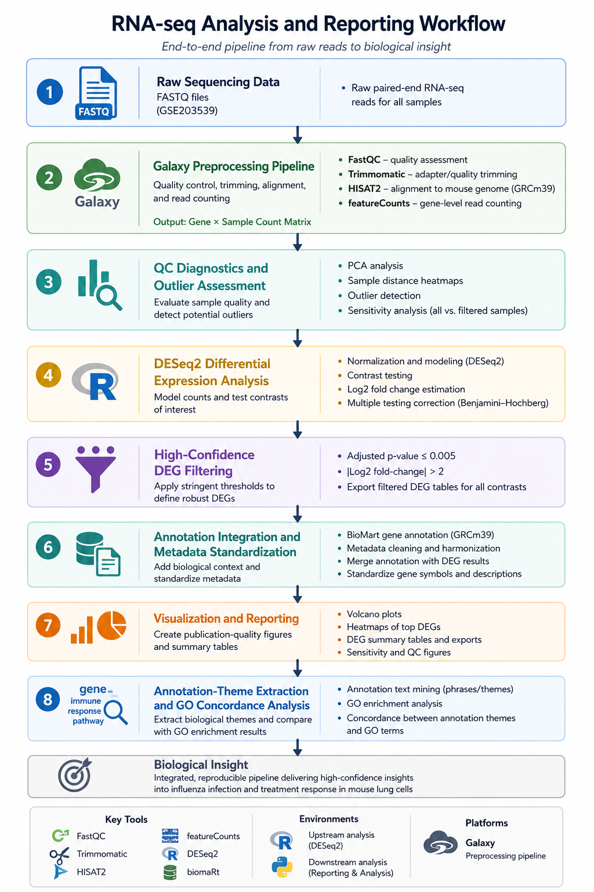
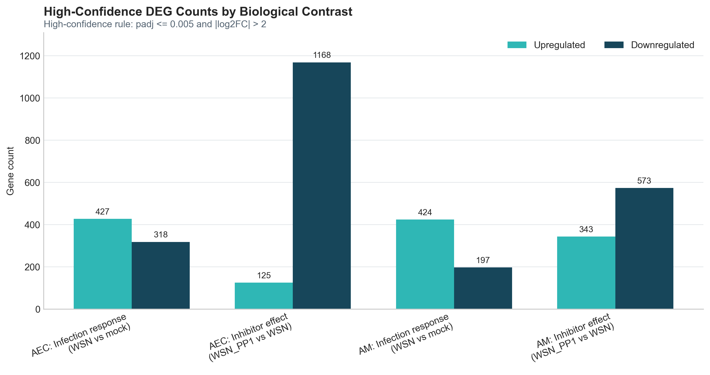
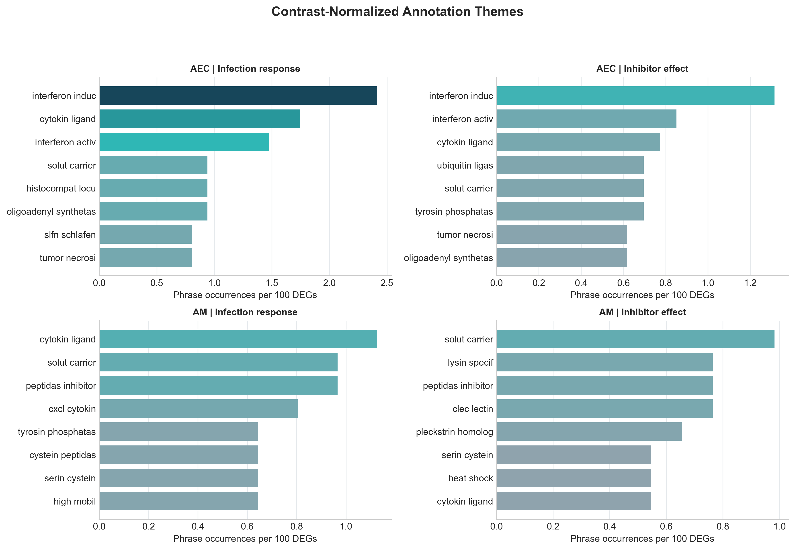

# 🧬 RNA-seq DESeq2 Differential Expression and Reporting Workflow

This workflow turns large gene-expression datasets into clear biological summaries and visualizations, reducing the manual effort traditionally required to interpret results across multiple bioinformatics tools and databases.

<p align="center">
  
</p>
End-to-end workflow from raw RNA-seq reads through differential expression analysis, downstream reporting, and biological interpretation.

---

## Key Finding

Influenza infection induced strong antiviral and inflammatory gene-expression responses, while inhibitor treatment reversed many infection-associated changes. Annotation-based theme extraction recovered many of the same broad biological patterns identified through formal GO enrichment, particularly for antiviral immune-response pathways.



### Annotation Theme Extraction



Contrast-normalized annotation themes highlighted strong interferon and immune-response programs during influenza infection while revealing broader inflammatory and signaling-associated patterns across contrasts. This downstream reporting layer extends beyond standard DESeq2 outputs by integrating annotation-derived biological interpretation directly into reproducible reporting workflows.

---

This project combines:
- upstream RNA-seq QC and DESeq2 differential expression analysis in R  
  📄 [R pipeline summary PDF](rna_seq_deseq2_workflow_summary.pdf)

- downstream reporting, visualization, and annotation-theme analysis workflows in Python  
  📓 [Downstream reporting and GO concordance notebook](downstream_reporting_and_go_analysis.ipynb)

---

## Dataset

Public GEO dataset: **GSE203539**

Model system:
- Influenza A virus (IAV) infection
- Mouse lung cell populations

Cell types:
- Alveolar epithelial cells (AEC)
- Alveolar macrophages (AM)

Experimental contrasts:
- WSN vs Mock
- WSN_PP1 vs WSN

---

## Methods

### RNA-seq Analysis (R)
- DESeq2 differential expression analysis
- PCA and sample distance QC diagnostics
- Outlier sensitivity analysis
- Volcano plots and DEG heatmaps
- Reproducible export workflows

### Downstream Reporting (Python)
- DEG consolidation across contrasts
- Metadata cleaning and aggregation
- Annotation-based biological theme extraction
- GO concordance comparison
- Reporting-oriented visualization workflows

High-confidence DEGs were defined using:
- adjusted p-value ≤ 0.005
- absolute log2 fold-change > 2

---

## Reproducibility

### Python reporting environment

Create the Conda environment:

```bash
conda env create -f environment.yml
conda activate rna-seq-reporting
```

Launch Jupyter:

```bash
jupyter lab
```

Main downstream notebook:

```text
downstream_reporting_and_go_analysis.ipynb
```

---

### R / DESeq2 workflow

Install required R packages listed in:

```text
R_packages.txt
```

Main upstream workflow:

```text
DESeq2_GSE203539.Rmd
```

---

### Input data

The `data/` directory contains:
- annotated DESeq2 contrast tables
- merged count matrix
- BioMart-derived mouse gene metadata

Public dataset source: GEO accession: `GSE203539`
